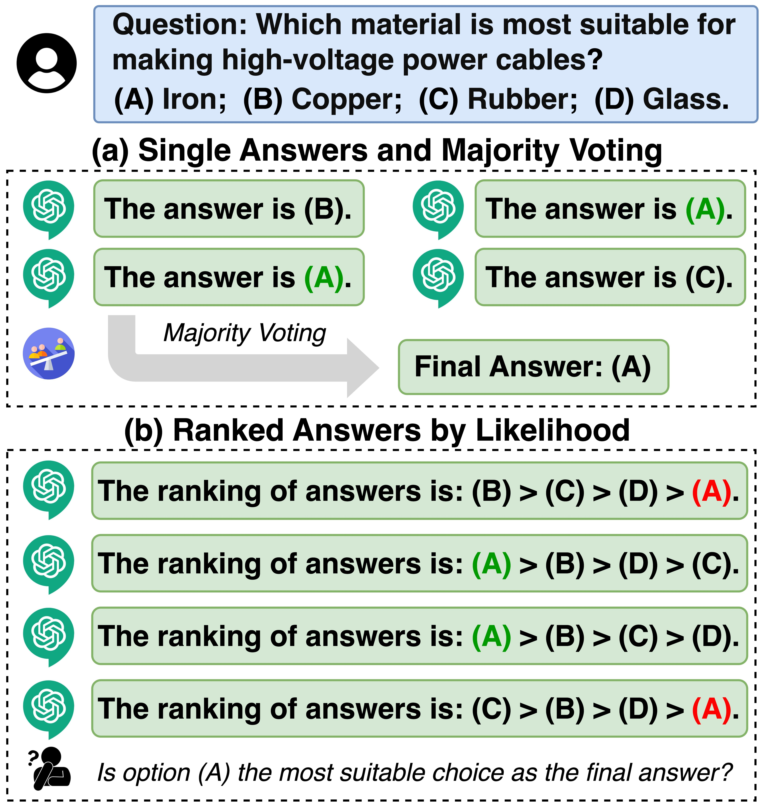
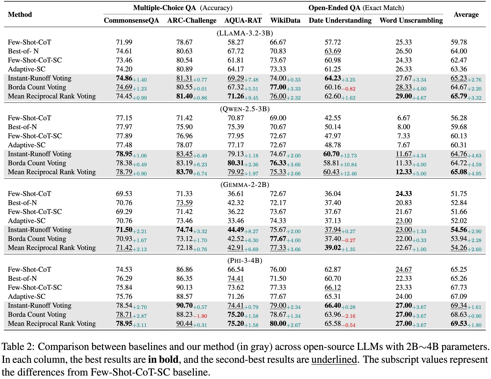
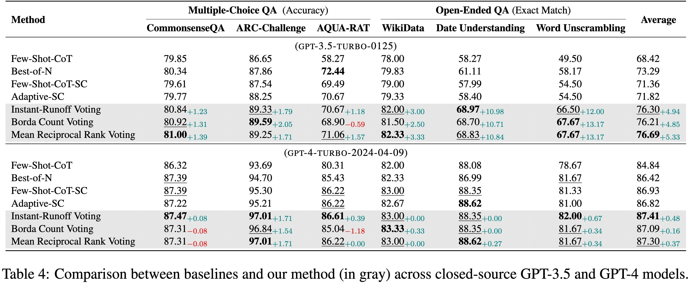

# Ranked Voting based Self-Consistency of Large Language Models

# 🎉News

- **[2025-02-15]** We present **Ranked Voting based Self-Consistency** , a test time compute method for LLMs in reasoning tasks.

# 📖Introduction

We study the enhancement of reasoning performance in Large Language Models (LLMs) by leveraging ranked answers instead of single outputs. Traditional self-consistency approaches rely on majority voting among independently generated answers, yet they often overlook valuable information encoded in the relative likelihood of alternative choices. We find that prompting LLMs to produce ranked lists of candidate answers enables the use of ranked voting methods, such as instant-runoff voting, Borda count, and mean reciprocal rank voting, which yield more reliable self-consistency signals. Our results show that incorporating ranked answers leads to consistent performance improvements across both multiple-choice and open-ended reasoning tasks.

<p align="center">
   
</p>

<p align="center">
   
</p>

# 📃Evaluation

<details>
<summary>
  Evaluation Details
</summary>
Our experiments demonstrate that ranked voting based self-consistency consistently improves reasoning performance across a variety of tasks and models. Furthermore, although ranked voting only leverages the ranking information among multiple candidate answers, it consistently surpasses traditional majority voting baselines, and approaches or even exceeds the performance of stronger methods that require additional supervision or complex response selection strategies.

2 to 4B open-source LLMs:
<p align="center">
   
</p>

7 to 9B open-source LLMs
<p align="center">
   
</p>

closed-source LLMs
<p align="center">
   
</p>

</details>

# ✨Getting Started

```bash
git clone https://github.com/szu-tera/RankedVotingSC.git
cd code

pip install -e .
```

# 🎈Citation
todo
