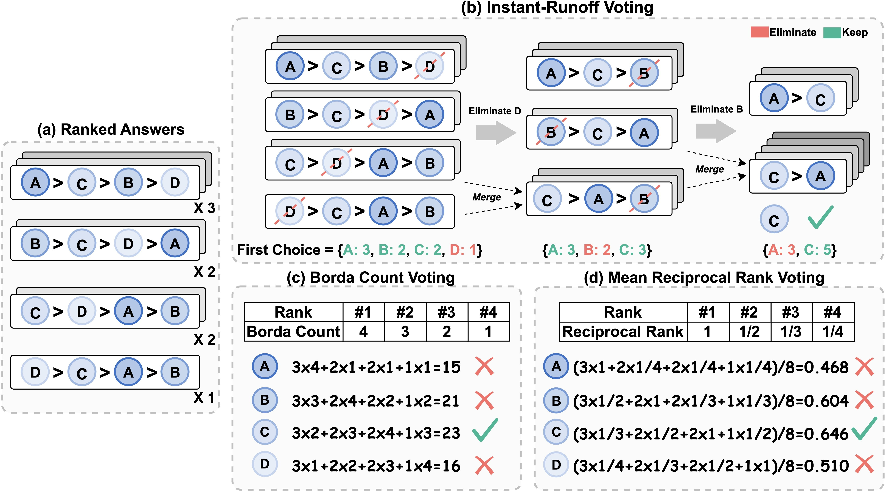

# Ranked Voting based Self-Consistency of Large Language Models

## Quick Links

- [Overview](#overview)
- [Project Structure](#project-structure)
- [Getting Started](#getting-started)
- [Evaluation](#evaluation)
  - [Step 1: Generate Model Outputs](#step-1-generate-model-outputs)
  - [Step 2: Perform Ranked Voting and Evaluation](#step-2-perform-ranked-voting-and-evaluation)
  - [Expected Output](#expected-output)

## Overview

Ranked Voting based Self-Consistency (RankedVotingSC) is a method that improves large language models’ reasoning by generating ranked answers and applying ranked voting across multiple outputs. Experiments on multiple-choice and open-ended QA tasks show that RankedVotingSC outperforms traditional majority voting by producing more reliable final answers.

<p align="center">
   
</p>


## Project Structure

The repository is organized as follows:

```
RankedVotingSC/
├── RankedVotingSC/             # core source package
│   ├── __init__.py
│   └── RankBasedSC.py
├── data/                       # data generated by different methods
├── figs/                       # figures used in the paper
├── lm-evaluation-harness/      # generation + evaluation framework dependency
├─ .gitignore
├── LICENSE
├── README.md
├── evaluate.py                 # evaluation script
├── evaluate.sh                 # command-line runner
├── requirements.txt            # required packages
└── utils.py                    # utility helpers
```

## Getting Started

Clone our repository and install the required environment:

```shell
# Clone the repository
git clone https://github.com/szu-tera/RankedVotingSC.git

# install required packages
cd RankedVotingSC
pip install -r requirements.txt

# Install lm-evaluation-harness
cd lm-evaluation-harness
pip install -e .
```

## Evaluation

First, define a task YAML file under `code/lm-evaluation-harness/lm_eval/tasks/`.  
For example, the task configuration for **Gemma-2-9b-it** on **CommonsenseQA (CSQA)** can be found [here](https://github.com/szu-tera/RankedVotingSC/blob/main/lm-evaluation-harness/lm_eval/tasks/CSQA/CSQA.yaml) (If you need to implement a new task, please refer to [this guide](https://github.com/EleutherAI/lm-evaluation-harness/blob/main/docs/new_task_guide.md)).

Next, we provide a step-by-step demonstration using **Gemma-2-9b-it** on the **CSQA** dataset (example outputs [here](https://github.com/szu-tera/RankedVotingSC/blob/main/data/samples.json)) as an example:

---

### Step 1: Generate Model Outputs

Run the following command to generate outputs from the model:

```shell
accelerate launch -m lm_eval \
    --model hf \
    --model_args pretrained=[path/to/your/model],dtype=bfloat16 \
    --apply_chat_template \
    --fewshot_as_multiturn \
    --log_samples \
    --output_path RankedVotingSC/data \
    --tasks CSQA-RankedVoting \
    --batch_size auto
```

> **Note:** Replace `[path/to/your/model]` with your local model path or the Huggingface model ID.  

---

Arguments for the generation script are as follows,

- `--model`: Specify the format of the model to use.
  - `hf`: Use Huggingface format.

- `--model_args`: Specify the model path and the precision type.
  - `pretrained`: Path to the model on Huggingface or local directory.
  - `dtype`: Precision type for loading (e.g., bfloat16).

- `--apply_chat_template`: Apply the chat template formatting to input prompts.

- `--fewshot_as_multiturn`: Format few-shot examples as multi-turn dialogues.

- `--log_samples`: Save generated samples for further filtering and voting.

- `--output_path`: Specify the directory where output files (e.g., `RankedVotingSC/data`) will be saved.

- `--tasks`: Specify the evaluation task (e.g., `CSQA-RankedVoting`).

- `--batch_size`: Specify the batch size for generation.
  - `auto`: Automatically adjust the batch size based on available GPU memory.

---

### Step 2: Perform Ranked Voting and Evaluation

After generating the outputs, use the following command to conduct Ranked Voting and evaluate performance:

```shell
python evaluate.py \
    --cot_file data/cot_samples.json \
    --bon_file data/bon_samples.json \
    --sc_file data/sc_samples.json \
    --ac_file data/ac_samples.json \
    --rc_file data/rc_samples.json \
```

You can also use `evaluate.sh` to instead.

---

Arguments for the evaluation script are as follows,

- `--cot_file`: Path to CoT (Chain of Thought) generation results (optional).

- `--bon_file`: Path to BoN (Best of N) generation results (optional).

- `--sc_file`: Path to SC (Self-Consistency) generation results (optional).

- `--ac_file`: Path to AC (Adaptive Consistency) generation results (optional).

- `--rc_file`: Path to the Ranked Consistency input file (required).

### Expected Output

```
+---------+----------+----------+----------+----------+----------+----------+----------+
| Methods |   CoT    |   BoN    |    SC    |    AC    |   IRV    |   BCV    |   MRRV   |
+---------+----------+----------+----------+----------+----------+----------+----------+
|   Accs  | 0.799345 | 0.806716 | 0.804259 | 0.812449 | 0.832105 | 0.829648 | 0.830467 |
+---------+----------+----------+----------+----------+----------+----------+----------+
```

## Contact

- Weiqin Wang: here1swqw@gmail.com

  
