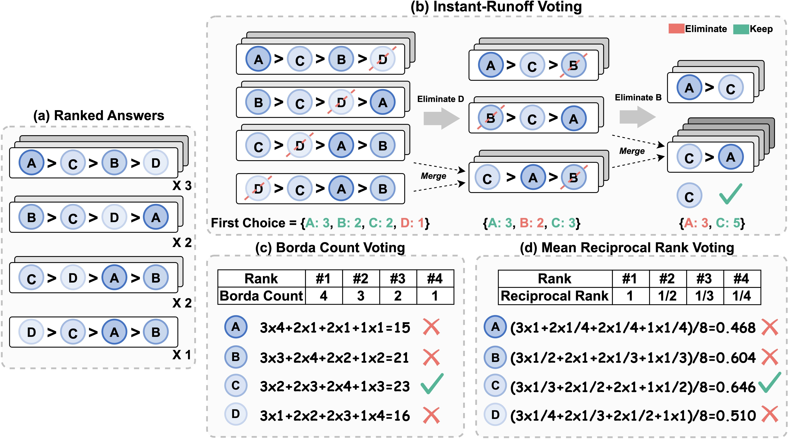

<div align="center">
  
# Ranked Voting based Self-Consistency of Large Language Models


[](https://arxiv.org/abs/2505.10772)  [](https://github.com/szu-tera/RankedVotingSC)


<div align="center" style="font-family: Arial, sans-serif;">
  <p>
    <a href="#news" style="text-decoration: none; font-weight: bold;">🎉 News</a> •
    <a href="#overview" style="text-decoration: none; font-weight: bold;">📌 Overview</a> •
    <a href="#project-structure" style="text-decoration: none; font-weight: bold;">📁 Project Structure</a>
  </p>
  <p>
    <a href="#getting-started" style="text-decoration: none; font-weight: bold;">✨ Getting Started</a> •
    <a href="#evaluation" style="text-decoration: none; font-weight: bold;">📃 Evaluation</a> •
    <a href="#contact" style="text-decoration: none; font-weight: bold;">📨 Contact</a> •
    <a href="#citation" style="text-decoration: none; font-weight: bold;">🎈 Citation</a>
  </p>
</div>

</div>


## 🎉 News

- **[2025/05/16]** We release our paper on arXiv.

- **[2025/05/15]** Our paper is accepted by ACL 2025 as Findings. 

- **[2025/04/28]** We release our code for RankedVotingSC.

## 📌Overview

Ranked Voting based Self-Consistency (RankedVotingSC) is a method that improves large language models’ reasoning by generating ranked answers and applying ranked voting across multiple outputs. Experiments on multiple-choice and open-ended QA tasks show that RankedVotingSC outperforms traditional majority voting by producing more reliable final answers.

<p align="center">
   
</p>


## 📁Project Structure

The repository is organized as follows:

```
RankedVotingSC/
├── RankedVotingSC/             # core source package
│   ├── __init__.py
│   └── RankBasedSC.py
├── adaptive_consistency/       # source code of adaptive-consistency
├── data/                       # data generated by different methods
├── figs/                       # figures used in the paper
├── lm-evaluation-harness/      # generation + evaluation framework dependency
├─ .gitignore
├── LICENSE
├── README.md
├── evaluate.py                 # evaluation script
├── evaluate.sh                 # command-line runner
├── requirements.txt            # required packages
└── utils.py                    # utility helpers
```

## ✨Getting Started

Clone our repository and install the required environment:

```shell
# Clone the repository
git clone https://github.com/szu-tera/RankedVotingSC.git

# install required packages
cd RankedVotingSC
pip install -r requirements.txt

# Install lm-evaluation-harness
cd lm-evaluation-harness
pip install -e .
```

## 📃Evaluation

First, define a task YAML file under `code/lm-evaluation-harness/lm_eval/tasks/`.  
For example, the task configuration for **Gemma-2-9b-it** on **CommonsenseQA (CSQA)** can be found [here](https://github.com/szu-tera/RankedVotingSC/blob/main/lm-evaluation-harness/lm_eval/tasks/CSQA/CSQA.yaml) (If you need to implement a new task, please refer to [this guide](https://github.com/EleutherAI/lm-evaluation-harness/blob/main/docs/new_task_guide.md)).

Next, we provide a step-by-step demonstration using **Gemma-2-9b-it** on the **CSQA** dataset (example outputs [here](https://github.com/szu-tera/RankedVotingSC/blob/main/data/samples.json)) as an example:

---

### Step 1: Generate Model Outputs

Run the following command to generate outputs from the model:

```shell
accelerate launch -m lm_eval \
    --model hf \
    --model_args pretrained=[path/to/your/model],dtype=bfloat16 \
    --apply_chat_template \
    --fewshot_as_multiturn \
    --log_samples \
    --output_path RankedVotingSC/data \
    --tasks CSQA-RankedVoting \
    --batch_size auto
```

> **Note:** Replace `[path/to/your/model]` with your local model path or the Huggingface model ID.  

---

Arguments for the generation script are as follows,

- `--model`: Specify the format of the model to use.
  - `hf`: Use Huggingface format.

- `--model_args`: Specify the model path and the precision type.
  - `pretrained`: Path to the model on Huggingface or local directory.
  - `dtype`: Precision type for loading (e.g., bfloat16).

- `--apply_chat_template`: Apply the chat template formatting to input prompts.

- `--fewshot_as_multiturn`: Format few-shot examples as multi-turn dialogues.

- `--log_samples`: Save generated samples for further filtering and voting.

- `--output_path`: Specify the directory where output files (e.g., `RankedVotingSC/data`) will be saved.

- `--tasks`: Specify the evaluation task (e.g., `CSQA-RankedVoting`).

- `--batch_size`: Specify the batch size for generation.
  - `auto`: Automatically adjust the batch size based on available GPU memory.

---

### Step 2: Perform Ranked Voting and Evaluation

After generating the outputs, use the following command to conduct Ranked Voting and evaluate performance:

```shell
python evaluate.py \
    --cot_file data/cot_samples.json \
    --bon_file data/bon_samples.json \
    --sc_file data/sc_samples.json \
    --ac_file data/ac_samples.json \
    --rc_file data/rc_samples.json \
```

You can also use `evaluate.sh` to instead.

---

Arguments for the evaluation script are as follows,

- `--cot_file`: Path to CoT (Chain of Thought) generation results (optional).

- `--bon_file`: Path to BoN (Best of N) generation results (optional).

- `--sc_file`: Path to SC (Self-Consistency) generation results (optional).

- `--ac_file`: Path to AC (Adaptive Consistency) generation results (optional).

- `--rc_file`: Path to the Ranked Consistency input file (required).

### Expected Output

```
+---------+----------+----------+----------+----------+----------+----------+----------+
| Methods |   CoT    |   BoN    |    SC    |    AC    |   IRV    |   BCV    |   MRRV   |
+---------+----------+----------+----------+----------+----------+----------+----------+
|   Accs  | 0.799345 | 0.806716 | 0.804259 | 0.812449 | 0.832105 | 0.829648 | 0.830467 |
+---------+----------+----------+----------+----------+----------+----------+----------+
```

## 📨Contact

- Weiqin Wang: here1swqw@gmail.com

## 🎈Citation

If you find this repository useful for your research, please consider citing our paper:

```bibtex
@inproceedings{wang-etal-2025-ranked,
    title = "Ranked Voting based Self-Consistency of Large Language Models",
    author = "Wang, Weiqin  and
      Wang, Yile  and
      Huang, Hui",
    editor = "Che, Wanxiang  and
      Nabende, Joyce  and
      Shutova, Ekaterina  and
      Pilehvar, Mohammad Taher",
    booktitle = "Findings of the Association for Computational Linguistics: ACL 2025",
    month = jul,
    year = "2025",
    address = "Vienna, Austria",
    publisher = "Association for Computational Linguistics",
    url = "https://aclanthology.org/2025.findings-acl.744/",
    doi = "10.18653/v1/2025.findings-acl.744",
    pages = "14410--14426",
    ISBN = "979-8-89176-256-5",
    abstract = "Majority voting is considered an effective method to enhance chain-of-thought reasoning, as it selects the answer with the highest ``self-consistency'' among different reasoning paths (Wang et al., 2023). However, previous chain-of-thought reasoning methods typically generate only a single answer in each trial, thereby ignoring the possibility of other potential answers. As a result, these alternative answers are often overlooked in subsequent voting processes. In this work, we propose to generate ranked answers in each reasoning process and conduct ranked voting among multiple ranked answers from different responses, thereby making the overall self-consistency more reliable. Specifically, we use three ranked voting methods: Instant-runoff voting, Borda count voting, and mean reciprocal rank voting. We validate our methods on six datasets, including three multiple-choice and three open-ended question-answering tasks, using both advanced open-source and closed-source large language models. Extensive experimental results indicate that our proposed method outperforms the baselines, showcasing the potential of leveraging the information of ranked answers and using ranked voting to improve reasoning performance. Code and logs will be released."
}
```

  
